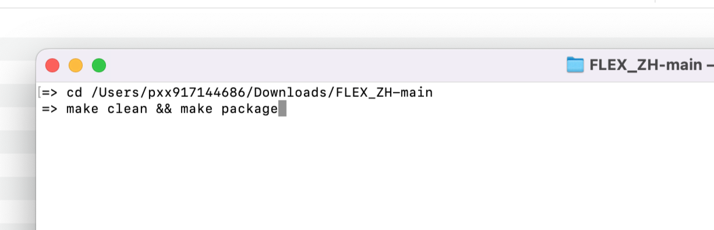
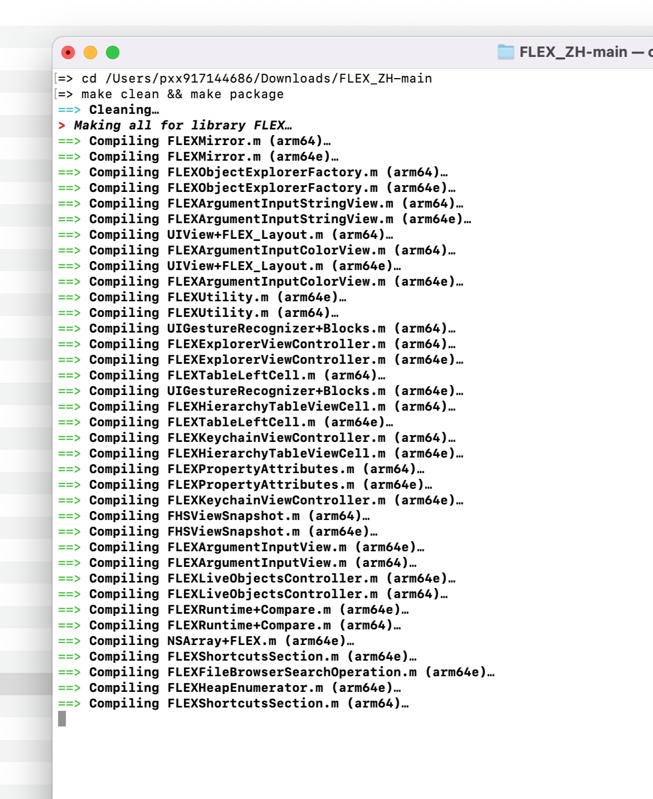
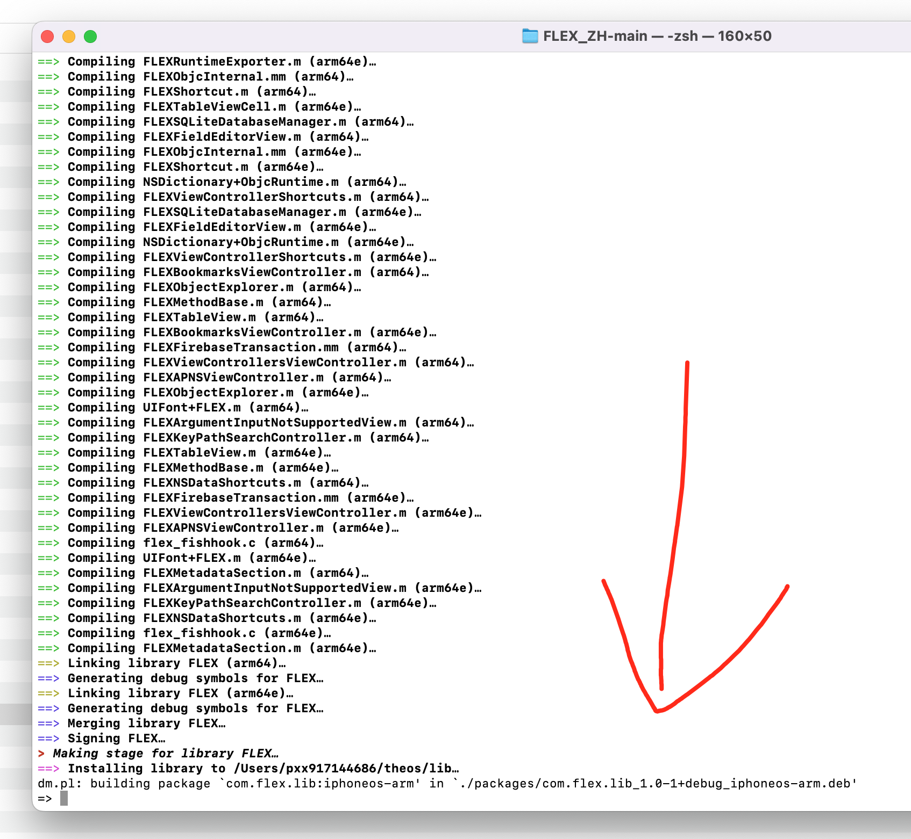

```js
终端执行 克隆 Theos 仓库
git clone --recursive https://github.com/theos/theos.git

将 Theos 的路径添加到环境变量中：
方法一：
终端执行 直接添加到 ~/theos

export THEOS=~/theos
export PATH=$THEOS/bin:$PATH

终端执行  重新 加载配置：
source ~/.zshrc

另一种方法：
终端执行 打开配置文件 .zshrc
nano ~/.zshrc

# Theos 配置  // theos文件夹 的本地路径
export THEOS=/Users/pxx917144686/theos     

之后；contron + X 是退出编辑； 按‘y’ 保存编辑退出！

终端执行  重新 加载配置：
source ~/.zshrc
```







